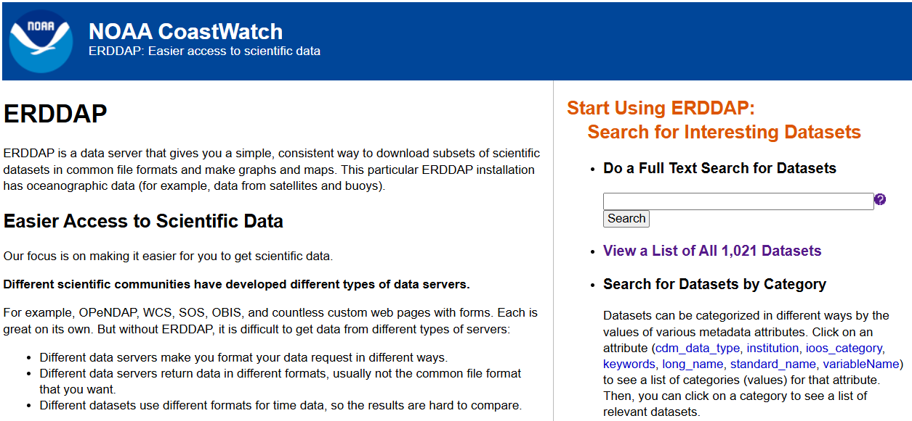
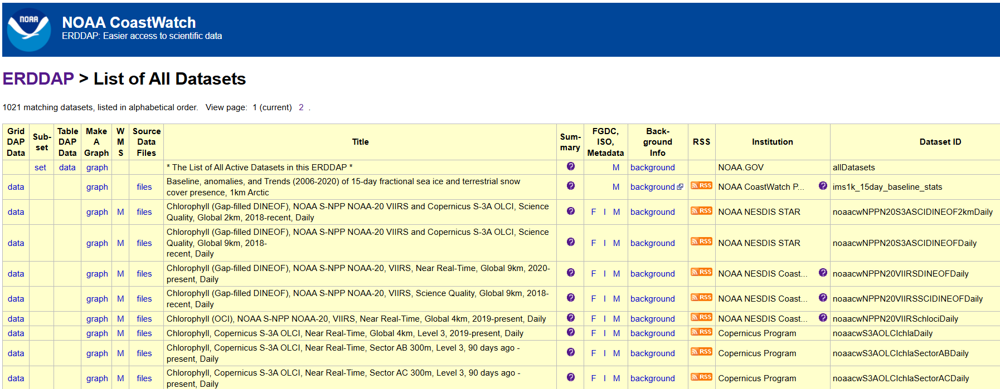
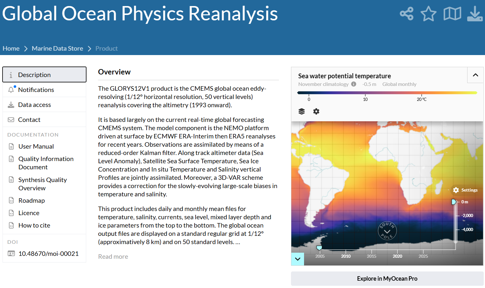
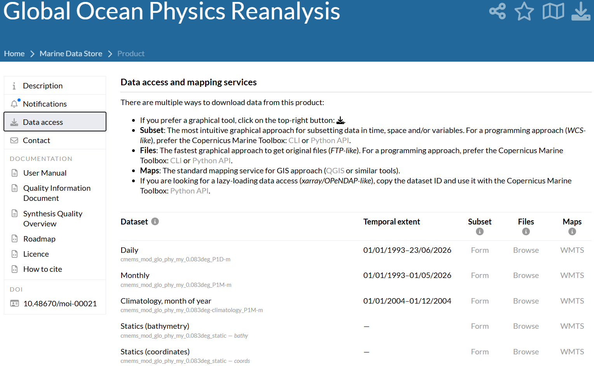
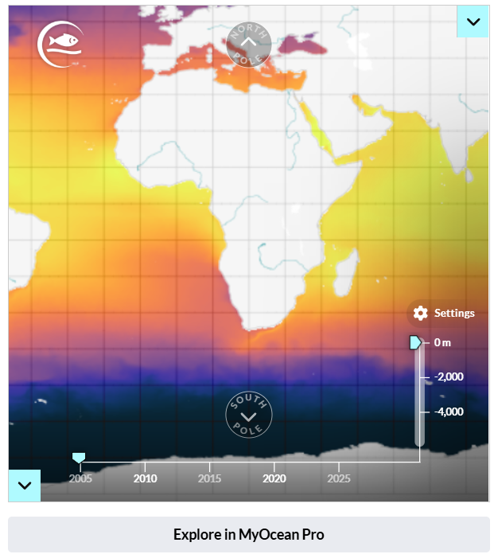
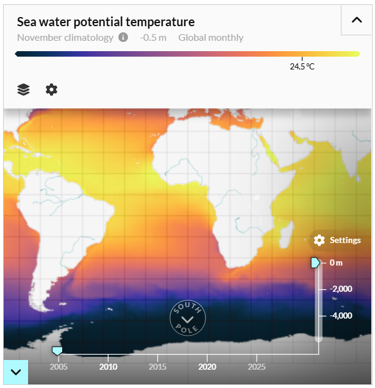
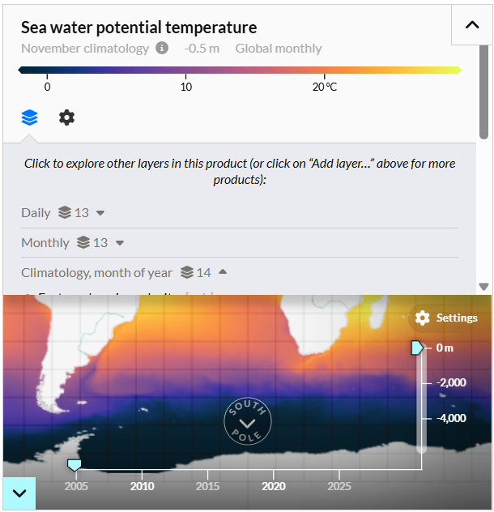
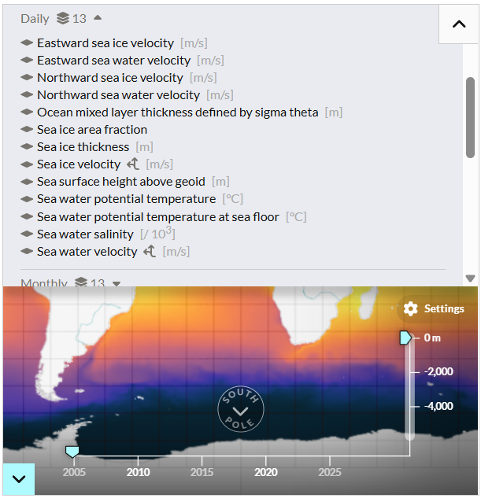
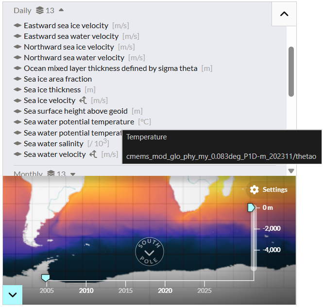

Image credits: [Global Ocean Physics Analysis and Forecast](https://data.marine.copernicus.eu/-/qcecrekxcb). E.U. Copernicus Marine Service Information (CMEMS). Marine Data Store (MDS). DOI: <https://doi.org/10.48670/moi-00016> (Accessed on 31 08 2026)

# [EN] Downloading satellite data

In this post, we will show how to download satellite data from two sources:

* **ERDDAP (Environmental Research Division's Data Access Program)** is a server that facilitates access to environmental scientific data from different sources. It allows users to query, visualize, and download data (e.g. temperature, salinity, chlorophyll, or currents) in different formats and through different interfaces, including automated requests. Its main advantage is that it standardizes access to data from multiple providers, avoiding the need to learn a different interface for each source.

* **Copernicus** is the European Union's Earth observation programme. Through its different services, it provides large volumes of environmental data obtained from satellites, *in situ* observations, and numerical models. For the marine domain, the Copernicus Marine service provides information on variables such as temperature, salinity, currents, sea level, and sea ice, with different spatial and temporal resolutions.

## Download limits

Both sources provide online graphical interfaces that make it easy to define a subset and download a specific dataset in different formats. However, there are some limitations to using these graphical interfaces, one of the most important being the download size limit, which depends on the format and server configuration. For example, for ERDDAP, 2 GB is particularly relevant for NetCDF-3 files, while for Copernicus, the limit is around 800 MB.

These limits are particularly relevant when it is necessary to download data over a large spatial and/or temporal domain. In such cases, the best strategy is to perform successive downloads of *subsets* that can then be read and merged (or simply stored for later analysis). For example, if the goal is to download Sea Surface Temperature data over the domain \(85°W - 70°W\) and \(18°S - 2°S\) (at a 0.25-degree resolution) between 2010-01-01 and 2025-12-31 (at daily resolution), a good strategy would be to perform successive *monthly* downloads; that is, one NetCDF file for the entire area between 2010-01-01 and 2010-01-31, another between 2010-02-01 and 2010-02-28, and so on. This process requires automation, and the goal of this post is to show which tools are available for performing these successive downloads using R.

## ERDDAP

For ERDDAP, there is already an [R package on CRAN](https://cran.r-project.org/package=rerddap) called **rerddap** that allows users to perform successive downloads. The first step is to determine which server hosts the product that will be useful for our purposes. For our example, we will use the [NOAA CoastWatch](https://coastwatch.noaa.gov/erddap/) server.

{#fig-erddap-home}

{#fig-erddap-dataset-list}

@fig-erddap-dataset-list shows what the dataset list of an ERDDAP data source looks like. We will use the dataset called *Sea-Surface Temperature, NOAA ACSPO Daily Global 0.02° Gridded Super-collated SST and Thermal Fronts Reanalysis, 2012-present, Daily (L3S-LEO Kelvin)*, whose Dataset ID is **noaacwLEOACSPOSSTL3SKDaily**.

Using this ID, we can use the functions provided by **rerddap** to find out the available domain for downloading data:

```{r}
require(rerddap)

sourceInfo <- info(
  datasetid = "noaacwLEOACSPOSSTL3SKDaily",
  url = "https://coastwatch.noaa.gov/erddap/" 
)

sourceInfo
```

::: {.callout-caution title="Más fuentes ERDDAP" collapse="true"}
**rerddap** contains an internal list of some public servers from which we can download our data. We simply need to run the following:

```{r}
require(rerddap)

servers() 
```
:::

Next, I will show how to perform a simple download, i.e. download a single NetCDF file containing the subset for January 2010:

```{r}
#| eval: false

require(rerddap)

temporalDir <- tempdir()

dataInfo <- griddap(
  datasetx = sourceInfo,
  time = c("2010-01-01T12:00:00Z", "2010-01-15T12:00:00Z") , 
  longitude = c(-85, -70), 
  latitude = c(-18, -2), 
  fields = c("sea_surface_temperature"), 
  read = FALSE,
  store = disk(temporalDir)
)

dataInfo
```

As you can see, the `dataInfo` object contains the name of the NetCDF file where our data has been downloaded (in the `dataInfo$summary$filename` slot). From this file, we can read the data directly, rename it, and/or move it to any other folder. If we intend to reuse the downloaded data, it is highly recommended that the file be renamed. In the second command of the script above, the destination folder for the file containing the data is defined. Again, it is strongly recommended that this folder not be a temporary folder, but rather a permanent one, if we intend to reuse the downloaded data.

### Multiple downloads

To perform multiple downloads, all we need to do is create a loop in which the iterator shifts the date range for each download. For example, to download data between January and March 2010, we can do the following:

```{r}
#| eval: false

# STEP 01
dateList <- seq(
  from = as.Date("2010-1-1"),
  by = "month",
  length.out = 4
)

# STEP 02
for(i in seq(length(dateList) - 1)){
  
  # STEP 03
  dateRange <- c(dateList[i], dateList[i] - 1)
  
  # STEP 04
  dataInfo <- griddap(
    datasetx = sourceInfo,
    time = dateRange, 
    longitude = c(-85, -70), 
    latitude = c(-18, -2), 
    fields = c("sea_surface_temperature"), 
    read = FALSE,
    store = disk(temporalDir)
  ) 
  
  # STEP 05
  newName <- file.path(
    dirname(dataInfo$summary$filename),
    format(x = dateRange[1], format = "%Y-%m")
  )
  
  # STEP 06
  file.rename(
    from = dataInfo$summary$filename,
    to = newName
  )
}
```

In the script above, we can identify 6 steps:

* **Step 01**: Generate a date vector. For this example, 4 start dates were generated (between January and April 2010).

* **Step 02**: Initialize the loop over the date vector. In particular, this loop will generate an iterator object `i` that will range from 1 to 3, i.e. one position less than the total length of the date vector generated in the previous step.

* **Step 03**: Define the date window. In this example, the window is defined from the date corresponding to the iterator value to the next date minus 1 day. For example, for January, it will range from January 1, 2010 to one day before February 1, 2010, i.e. January 31, 2010.

* **Step 04**: Download the corresponding file. This command is essentially the same as the one shown in the previous subsection (single-file download).

* **Step 05**: Define a new name for the downloaded file. As seen in the previous subsection, `griddap` downloads the data using a temporary file name. For this reason, it is necessary to predefine a name based on the time window. For example, in the script above, a YYYY-MM format is used for January 2010 (e.g. `2010-01`).

* **Step 06**: Rename the file.

## Copernicus

For Copernicus, the idea is very similar, except that we will use the Python application [copernicusmarine](https://toolbox-docs.marine.copernicus.eu/en/stable/). Although there is an R package on CRAN (also called copernicusmarine), as of the time of writing this post, I have not been able to achieve satisfactory download results with it. Therefore, I will show how to download the data using the Python tool directly, but from R through the tools provided by the [reticulate](https://cran.r-project.org/package=reticulate) package.

The list of available data sources can be found at https://data.marine.copernicus.eu/products. We will start with a simple download example:

* First, we will define a data source. For this example, we will use one called **Global Ocean Physics Reanalysis**.

  

* In the **Data access** tab, the list of available datasets is displayed. Below each item, its ID is shown; simply copy it and paste it into the corresponding argument. For our example, we will select the daily dataset: *cmems_mod_glo_phy_my_0.083deg_P1D-m*

  

* We will also need to specify the codes of the variables we want to download. This information can be found in the **Description** tab, using the map on the right-hand side.

  

* In the upper-right corner of the map, click the drop-down arrow:

  

* Now, click the layers button:

  

* Since we have decided to use the daily dataset, we will expand the variables within that dataset:

  

* Now, place the cursor over the variable of interest. A box will appear showing information about the name, dataset, and variable. In our case, the variable name is *thetao*. Repeat these steps to obtain the codes for all the variables we are interested in downloading.

  

Finally, once we have the dataset ID and the names of the variables, we can run the following script:

```{r}
#| eval: false

require(reticulate)

entorno <- "DescargaCopernicus"
virtualenv_create(envname = entorno)
virtualenv_install(envname = entorno, packages = "copernicusmarine")
use_virtualenv(virtualenv = entorno, required = TRUE)
atributos_cms <- import(module = "copernicusmarine")

atributos_cms$subset(
  dataset_id        = "cmems_mod_glo_phy_my_0.083deg_P1D-m",
  variables         = list("thetao"),
  minimum_longitude = -85,
  maximum_longitude = -70,
  minimum_latitude  = -18,
  maximum_latitude  = -2,
  start_datetime    = "2023-03-01T00:00:00",
  end_datetime      = "2023-03-31T00:00:00",
  minimum_depth     = 0,
  maximum_depth     = 0.5,
  output_filename   = "file_out.nc"
)
```

---

# [ES] Descargar datos satelitales

En este post, mostraremos la manera de descargar datos satelitales desde dos fuentes:

- **ERDDAP (Environmental Research Division's Data Access Program)** es un servidor que facilita el acceso a datos científicos ambientales provenientes de diferentes fuentes. Permite consultar, visualizar y descargar datos (e.g. temperatura, salinidad, clorofila o corrientes) en distintos formatos y mediante diferentes interfaces, incluyendo solicitudes automatizadas. Su principal ventaja es que estandariza el acceso a datos provenientes de múltiples proveedores, evitando tener que aprender una interfaz diferente para cada fuente.

- **Copernicus** es el programa de observación de la Tierra de la Unión Europea. A través de sus distintos servicios proporciona grandes volúmenes de datos ambientales obtenidos mediante satélites, observaciones in situ y modelos numéricos. Para el ámbito marino, el servicio Copernicus Marine ofrece información sobre variables como temperatura, salinidad, corrientes, nivel del mar y hielo marino, con diferentes resoluciones espaciales y temporales.

## Límites de descarga

Ambas fuentes ofrecen interfaces gráficas *on-line* que facilitan la definición de un subset y la descarga de un conjunto de datos específico en distintos formatos. Sin embargo, existen algunas limitaciones en el uso de sus interfaces gráficas y una de las más importantes es el límite de tamaño de descarga, el cual depende del formato y de la configuración del servidor. Por ejempoo, para ERDDAP, 2 GB es particularmente relevante para archivos NetCDF-3, mientras que para Copernicus, ese valor está alrededor de los 800 MB.

Estos límites resultan particularmente relevantes cuando es necesario realizar una descarga de datos para un dominio grande en espacio y/o tiempo. En esos casos, la mejor estrategia es realizar descargar sucesivas de *subsets* que luego pueden leerse y unirse (o, simplemente, guardarse para análisis posteriores). Por ejemplo, si el objetivo es descargar datos de Temperatura Superficial del Mar en el dominio de \[85°W - 70°W\] y \[18°S - 2°S\] (en resolución de 0,25 grados) y entre el 2010-01-01 y el 2025-12-31 (en resolución diaria), una buena estrategia sería la de obtener descargas sucesivas *por mes*; esto es, un archivo NetCDF para toda el área entre 2010-01-01 y 2010-01-31, otro entre 2010-02-01 y 2010-02-28, y así sucesivamente. Este proceso requiere automatización y este post tiene como objetivo mostrar qué herramientas existen para realizar estas descargas sucesivas a través de R.

## ERDDAP

Para ERDDAP, existe ya desarrollado un [paquete en CRAN](https://cran.r-project.org/package=rerddap) que permite realizar descargas sucesivas llamado **rerddap**. Un primer paso es averiguar en qué servidor se aloja el producto que nos será útil. Para nuestro ejemplo, vamos a utilizar el servidor de [NOAA CoastWatch](https://coastwatch.noaa.gov/erddap/).

{#fig-erddap-home}

{#fig-erddap-dataset-list}

En la @fig-erddap-dataset-list se muestra cómo luce el listado de una fuente cualquiera en ERDDAP. Vamos a tomar la fuente llamada *Sea-Surface Temperature, NOAA ACSPO Daily Global 0.02° Gridded Super-collated SST and Thermal Fronts Reanalysis, 2012-present, Daily (L3S-LEO Kelvin)*, cuyo Dataset ID es **noaacwLEOACSPOSSTL3SKDaily**.

A partir de este ID, podremos utilizar las funciones de rerddap para averiguar cuál es el dominio disponible para la descarga de datos:

```{r}
require(rerddap)

sourceInfo <- info(
  datasetid = "noaacwLEOACSPOSSTL3SKDaily",
  url = "https://coastwatch.noaa.gov/erddap/" 
)

sourceInfo
```

::: {.callout-caution title="Más fuentes ERDDAP" collapse="true"}
**rerddap** contiene un listado interno de algunos servidores públicos desde donde descargar nuestros datos. Basta con ejecutar lo siguiente:

```{r}
require(rerddap)

servers() 
```
:::

A continuación, mostraré de qué manera podemos realizar una descarga simple, i.e. descargar un solo archivo NetCDF con el subset para el mes de enero 2010:

```{r}
#| eval: false

require(rerddap)

temporalDir <- tempdir()

dataInfo <- griddap(
  datasetx = sourceInfo,
  time = c("2010-01-01T12:00:00Z", "2010-01-15T12:00:00Z") , 
  longitude = c(-85, -70), 
  latitude = c(-18, -2), 
  fields = c("sea_surface_temperature"), 
  read = FALSE,
  store = disk(temporalDir)
)

dataInfo
```

Como se puede ver, el objeto `dataInfo` contiene el nombre del archivo NetCDF en donde se ha descargado nuestra información (en el slot `dataInfo$summary$filename`). A partir de ese archivo, podemos leerlo directamente, renombrarlo y/o moverlo a cualquier otra carpeta. Si nuestra intención es reutilizar los datos descargados, se recomienda mucho que sea renombrado. En el segundo comando del sceript anterior, se define la carpeta de destino del archivo que contendrá los datos, una vez más, se recomienda fuertemente que esta carpeta no sea de tipo temporal, sino fija, si nuestra intención es reutilizar los datos descargados.

### Descarga múltiple

Para realizar una descarga múltiple, lo único que debemos hacer es generar un bucle en donde el iterador mueva el rango de fechas de cada descarga. Por ejemplo, para descargar datos entre enero y marzo de 2010, podremos hacer lo siguiente:

```{r}
#| eval: false

# STEP 01
dateList <- seq(
  from = as.Date("2010-1-1"),
  by = "month",
  length.out = 4
)

# STEP 02
for(i in seq(length(dateList) - 1)){
  
  # STEP 03
  dateRange <- c(dateList[i], dateList[i] - 1)
  
  # STEP 04
  dataInfo <- griddap(
    datasetx = sourceInfo,
    time = dateRange, 
    longitude = c(-85, -70), 
    latitude = c(-18, -2), 
    fields = c("sea_surface_temperature"), 
    read = FALSE,
    store = disk(temporalDir)
  ) 
  
  # STEP 05
  newName <- file.path(
    dirname(dataInfo$summary$filename),
    format(x = dateRange[1], format = "%Y-%m")
  )
  
  # STEP 06
  file.rename(
    from = dataInfo$summary$filename,
    to = newName
  )
}
```

En el script anterior se puede identificar 6 pasos:

- **Paso 01 (STEP 01)**: Generación de un vector de fechas. Para este ejemplo, se generó 4 fechas de inicio (entre enero y abril de 2010).

- **Paso 02**: Inicializar el bucle a lo largo del vector de fechas. Particularmente, este bucle generará un objeto iterador `i` que irá entre 1 y 3, i.e. una posición menos del largo total del vector de fecha generado en el paso anterior.

- **Paso 03**: Definición de la ventana de fechas. En este ejemplo, la ventana se define entre la fecha correspondiente al valor del iterador y la fecha siguiente menos 1 (día). Por ejemplo, para enero, irá entre el 01 de enero de 2010 y un día menos del 01 de febrero de 2010, i.e. el 31 de enero de 2010.

- **Paso 04**: Descarga del archivo correspondiente. Este comando es prácticamente el mismo que el mostrado en la subsección anterior (de descarga de un único archivo).

- **Paso 05**: Definición de un nombre nuevo para el archivo descargado. Como se vio en la subsección anterior, `griddap` descarga los datos usando un nombre de archivo temporal. Por este motivo, es necesario predefinir un nombre de acuerdo a la ventana de tiempo. Por ejemplo, en el script anterior, para enero de 2010, se define un nombre de la forma YYYY-MM (e.g. `2010-01`).

- **Paso 06**: Renombrar archivo.

## Copernicus

Para Copernicus, la idea es muy similar, solo que haremos uso del aplicativo de Python [copernicusmarine](https://toolbox-docs.marine.copernicus.eu/en/stable/). Si bien existe un paquete en CRAN (también llamado copernicusmarine), a la fecha en la que escribo este post, no he logrado alcanzar resultados satisfactorios de descarga, por lo que mostraré cómo descargar utilizando directamente la herramienta de Python, pero desde R a través de las herramientas del paquete [reticulate](https://cran.r-project.org/package=reticulate).

La lista de fuentes de descarga se encuentra disponible en <https://data.marine.copernicus.eu/products>. Iremos primero con un ejemplo de descarga simple:

- En primer lugar, defniremos una fuente. Para este ejemplo, usaremos una llamada **Global Ocean Physics Reanalysis**.

  

- En la pestaña **Data access**, se muestra el listado de los sets de datos disponibles. Debajo de cada ítem, se muestra su ID, bastará con copiarlo y pegarlo en el argumento correspondiente. Para nuestro ejemplo, seleccionaremos el set de datos diario: *cmems_mod_glo_phy_my_0.083deg_P1D-m*

  

- Así mismo, necesitaremos indicar el código de las variables que solicitaremos descargar. Esta información la podremos encontrar en la pestaña **Description**, a través del mapa en la parte derecha.

  

- En la esquina superior derecha del mapa, daremos click en la flecha desplegable:

  

- Ahora, damos click al botón de capas:

  

- Ya que nosotros hemos decidido ir por el dataset diario, desplegaremos las variables dentro de ese dataset:

  

- Ahora colocaremos el cursor encima de la variable que nos interesa y se desplegará un cuadro con información del nombre, del dataset y de la variable. En nuestro caso, el nombre de la variable es *thetao*. Repetiremos estos pasos para obtener los códigos de todas las variables que nos interese descargar.

  

Finalmente, ya que contamos con información del ID del data set y de los nombres de las variables, ejecutaremos el siguiente script:

```{r}
#| eval: false

require(reticulate)

entorno <- "DescargaCopernicus"
virtualenv_create(envname = entorno)
virtualenv_install(envname = entorno, packages = "copernicusmarine")
use_virtualenv(virtualenv = entorno, required = TRUE)
atributos_cms <- import(module = "copernicusmarine")

atributos_cms$subset(
  dataset_id        = "cmems_mod_glo_phy_my_0.083deg_P1D-m",
  variables         = list("thetao"),
  minimum_longitude = -85,
  maximum_longitude = -70,
  minimum_latitude  = -18,
  maximum_latitude  = -2,
  start_datetime    = "2023-03-01T00:00:00",
  end_datetime      = "2023-03-31T00:00:00",
  minimum_depth     = 0,
  maximum_depth     = 0.5,
  output_filename   = "file_out.nc"
)
```
